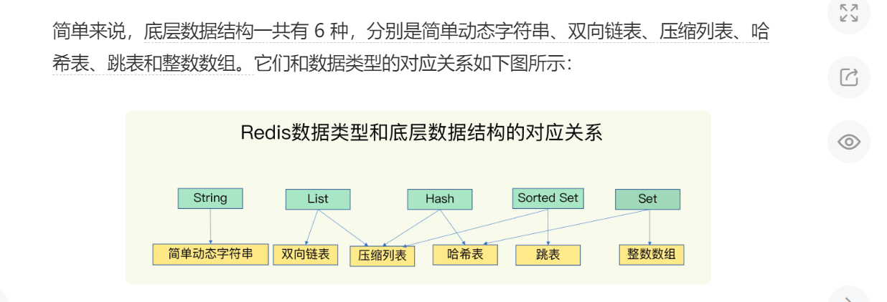
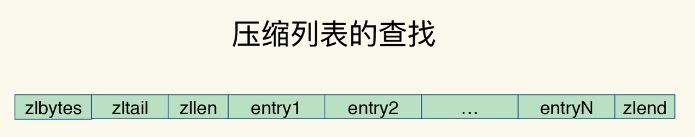

##底层数据结构

##数据存储
有一个全局hash表，key-value映射，hash冲突使用链式解决，渐进式rehash，初始有两个全局hash表，开始只用hash1，暂不给hash2分配空间，当产生大量冲突时，hash2分配空间一般为hash1两倍，开始渐进式rehash到hash2，直至hash1空作为下一次的后备。  
## 压缩列表
压缩列表实际上类似于一个数组，数组中的每一个元素都对应保存一个数据。和数组不同的是，压缩列表在表头有三个字段 zlbytes、zltail 和 zllen，分别表示列表长度、列表尾的偏移量和列表中的 entry 个数；压缩列表在表尾还有一个 zlend，表示列表结束。
在压缩列表中，如果我们要查找定位第一个元素和最后一个元素，可以通过表头三个字段的长度直接定位，复杂度是 O(1)。而查找其他元素时，就没有这么高效了，只能逐个查找，此时的复杂度就是 O(N) 了。

压缩列表的设计不是为了查询的，而是为了减少内存的使用和内存的碎片化。比如一个列表中的只保存int，结构上还需要两个额外的指针prev和next，每添加一个结点都这样。而压缩列表是将这些数据集合起来只需要一个prev和next。